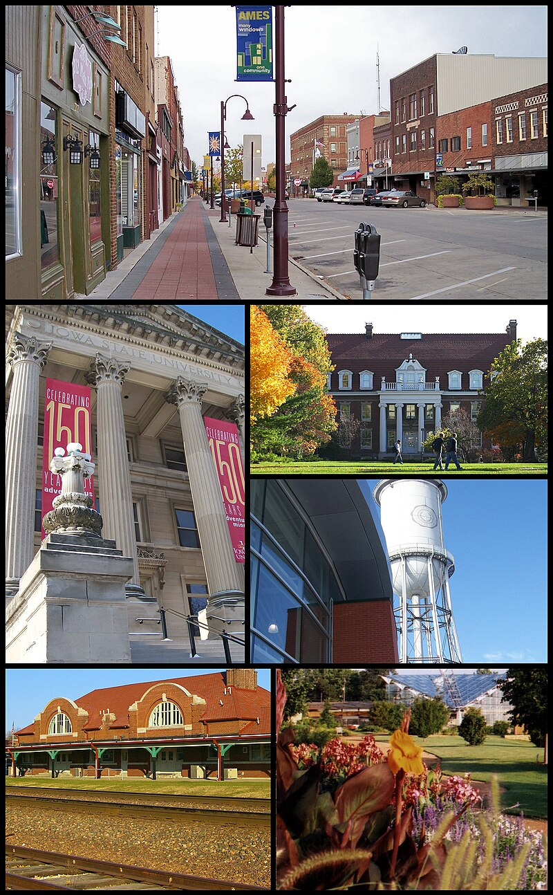
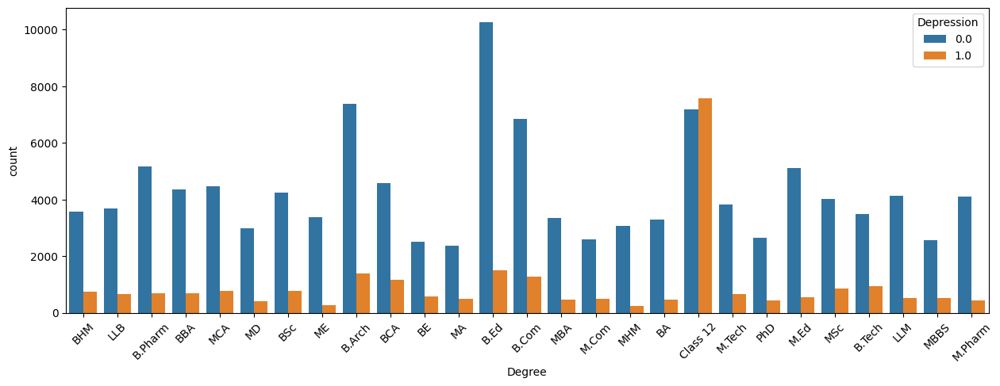
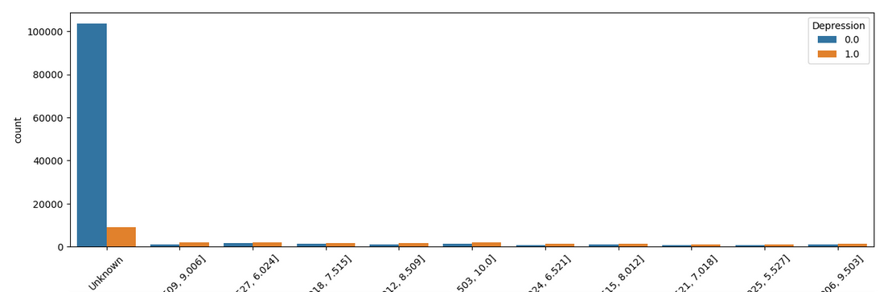
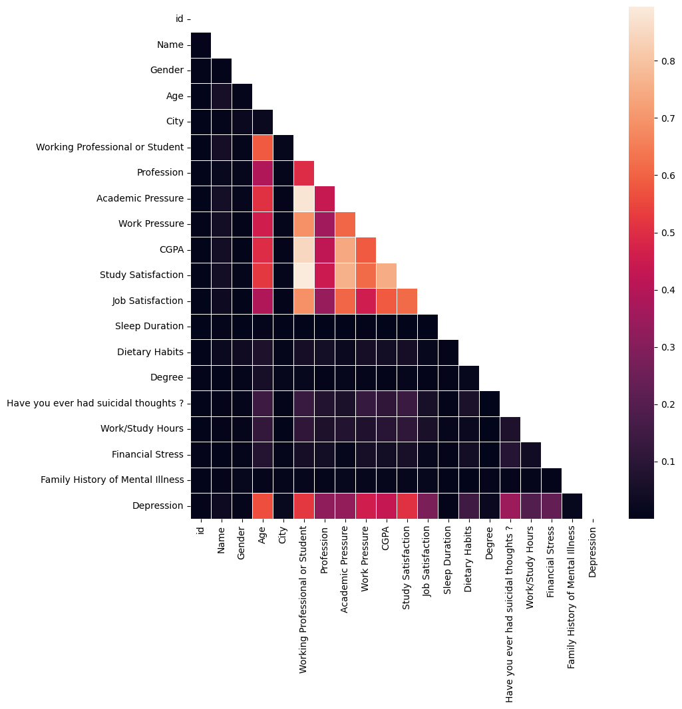

## Kaggle Notebooks Samples

These are some Kaggle Competitions I've been practicing my skills on. I document everything on this repo. I only show a small sample on what I worked on.

### Time Series Forecasting - Ecuador Store Sales

The challenge was to predict store sales in a given day in Ecuador. Few things I realized from this competition.

1. Oil prices affect store sales quite a bit. Ecuador relies on oil and changes in oil prices lead to big changes in its economy.
   
2. The grocery retailer the dataset is based on is well known as Corporación La Favorita. The company is a conglomerate grocery chain that also offers stores in other countries nearby Ecuador.
   

### Regression - House Prices

This challenge is to predict house prices in Ames, Iowa. There are quite a few surprising list of observations from this dataset.

1. The number of features is large at around 79 explanatory variables to determine the price of a home. This makes the resulting correlation matrix heatmap large but feature rich.
   
2. The town of Ames, Iowa is well known for close proximity to Iowa State University. The houses therefore cater to young students and often have low prices compared to national averages.
   

### Classification - Mental Health

We are set to predict whether a person is at risk of depression. The study is primarily focused across various cities in India. The samples contains diverse set of samples with people from different backgrounds and different ages.

1. From this dataset, it is clear that higher ages have lesser risk of being depressed. If we look closer, we realize that this is because college students have higher depression rates than people who are in profession. If we look even closer as to what's happening, we have higher depression rates for students with higher GPA's.

2. If we see the correlation heatmap, we can understand that much of depression risk is related to either school or work pressure and features related to these attributes.

From this data and outside research, it can be observed that students have big expectations from their families and society to maintain a strong academic performance in school. They face immense pressure from their peers as well. Additionally, India has an extremely competitive education system where students have to face difficult exams such as the JEE and the NEET to get into top universities. These exams easily determine their future. These are just some unfortunate reasons as to why we see such patterns in the dataset.
